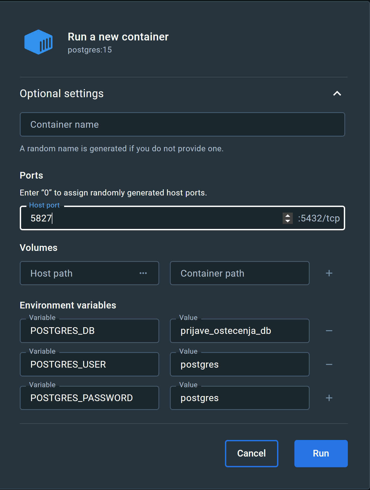

# progiProjekt

https://cestafix-fe.onrender.com
https://backend-j8o6.onrender.com/

### Postavke baze podataka (Linux)
Kako bi se aplikacija mogla pokrenut potrebno je imati pokrenutu i ispravno konfiguriranu instancu postgresql servera. Ove naredbe bi radile za Arch linux, ali varijacije na temu bi trebale biti za druge sustave:
```
sudo pacman -S postgresql
```
Instalacija (bar u ovom slučaju) kreira novog postgres korisnika na sustavu. Potrebno je ući u tog korisnika:
```
sudo -iu postgres
```
Baza se inicijalizira s hrvatskim postavkama lokala i UTF8 kodiranjem. Direktorij baze je proizvoljan. Naredba se **ne** pokreće kao root:

```
initdb -D /var/lib/postgres/data --locale=hr_HR.utf8 --encoding=UTF8 --auth-local=trust
```
Nakon toga pokrećemo postgresql server (za systemd sustave). Potrebno je prvo izaći iz postgres korisnika:
```
exit
sudo systemctl start postgresql.service
```
Pokretanje za ostale sustave:
```
pg_ctl -D /var/lib/postgres/data -l logfile start
```

Nakon toga napravimo superuser korisnika `admin` i bazu podataka `prijava_ostecenja_db`:
```
createuser -s admin
createdb prijava_ostecenja_db
```

# Upute za Docker
### O Dockeru
Docker su kontejneri, odnosni mali VM-ovi koji omogućavaju 
pokretanje razlicitih aplikacija, bez obzira na okruzenje 
u kojem se pokrecu. To radi tako sto se na DockerHubu vec nalaze pripremljeni
image-i koje pullamo i pokrecemo.

Primjerice, recimo za postgres postoji sluzbeni image na stranicama docker huba 
[postgres - Official Image Docker Hub](https://hub.docker.com/_/postgres)


U nasem slucaju, umjesto rucne instalacije postgres baze, 
mozemo pokrenuti Docker kontejner i spojiti nasu (backend) aplikaciju na kontejner 
i tokom testova, pokrenuti novu bazu, postaviti testne podatke, izvrsit testove 
i izbrisati bazu.

Ako pogledamo nasu backend aplikaciju, spring boot se (defaultno) pokrece na portu 8080.
Unutar Docker kontejnera, postgres se pokrece na 5432 portu. Mi ga mozemo bindati na taj port
na nasem lokalnom racunalu ili ga mozemo pokrenuti na drugom portu, recimo 5555. Tako cemo
imati na jednom portu backend dio aplikacije, a na drugom portu bazu podataka 
(i frontend na portu 3000).


### Docker Desktop
Preporucam da instalirate Docker Desktop pomocu kojeg mozete lagano pokrenuti
postgres bazu podataka klikom na 'Run'. Otvorit ce se novi prozor gdje mozete 
zadati Environment Variables i Host Port


Primjer lokalnog pokretanja (ako hocete rucno postaviti bazu
mozete ovako dodati Environment Variables i Host port)



Ako hocete pokrenuti postgres preko cmd-a, ovo su naredbe:
```
docker run -d \
--name my-postgres-container \
-e POSTGRES_USER=postgres \
-e POSTGRES_PASSWORD=postgres \
-e POSTGRES_DB=postgres \
-p 5555:5432 \
postgres:latest
```
